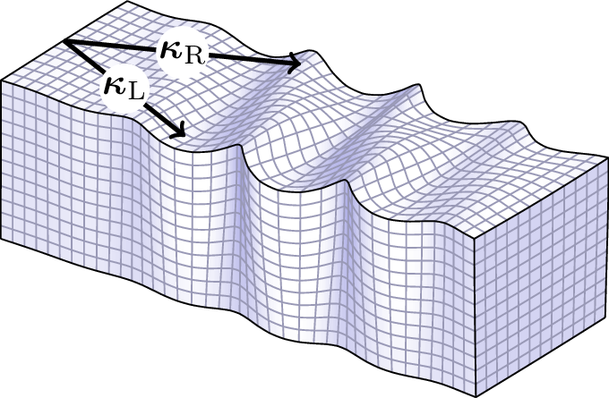

.. WaveDec documentation master file, created by
   sphinx-quickstart on Thu May 29 16:30:24 2014.
   You can adapt this file completely to your liking, but it should at least
   contain the root `toctree` directive.

===========================================
WaveDec: a tool for wavefield decomposition
===========================================

WaveDec is a software for the analysis of seismic surface waves. It provides maximum likelihood estimates of wave parameters for Love and Rayleigh waves. All the sensor components are analysed jointly. The simultaneous presence of multiple modes of propagation and multiple wave types (i.e., Love and Rayleigh) is accounted for. Estimated wave parameters include: Love and Rayleigh wave wavenumber, Rayleigh wave ellipticity angle, wave amplitude, and direction of arrival.

An overview of the method is available in the :doc:`scientific`, more details can be found in the referenced literature. See also the :doc:`frequently asked questions <faq>`.

The are are two main scripts:

* **WaveDec.py** can be used for the analysis of Love and Rayleigh waves and relies on the assumption of plane wavefronts (e.g. at large distance from the source). Translational and rotational motions can be jointly analysed. Applications include the analysis of **ambient vibrations**. See :doc:`userguide_WaveDec`.

* **WaveDecActive.py** can be used for the analysis of Rayleigh waves with circular wavefronts (e.g. at small distance from the source). Applications include the analysis of **active surveys**. See :doc:`userguide_WaveDecActive`.

Look at the :doc:`installation` and at the :doc:`quickstart` sections to run WaveDec as quickly as possible. A simple tool for picking, filtering and plotting is also provided, see :doc:`userguide_wdPicker`. 

Some :doc:`examples` are also provided.

The algorithm was developed at the `Swiss Seismological Service <http://www.seismo.ethz.ch/>`__ of `ETH Zurich <https://www.ethz.ch>`__.

Download
========

* `Download WaveDec and WaveDecActive code <http://mercalli.ethz.ch/~marra/WaveDec/WaveDec.zip>`__
* `Download examples and documentation for WaveDec and WaveDecActive <http://mercalli.ethz.ch/~marra/WaveDec/WaveDec_examples.zip>`__

The software is available upon request. Please send an email to :math:`\textrm{wavedec@gmail.com}` to obtain download credentials.

Usage of the software is limited to non-commercial use (that is, educational and research purposes). If you use the software in your work, please acknowledge us, see :ref:`howtociteus`.

Last Changes
============
* 15/7/2017: Created a new page: :doc:`faq`.
* 15/6/2017: Updated the examples concerning rotational motions, see Section :ref:`Plane waves (translational and rotational motions) <Examples6C>`.
* 29/5/2017: Following the acceptance for publication of our article `"Analysis of Rayleigh Waves with Circular Wavefront: a Maximum Likelihood Approach" <https://doi.org/10.1093/gji/ggx225>`__, the code WaveDecActive.py is released in the main distribution together with WaveDec.py.
* 12/5/2017: Added support for the option ``Tstart`` in WaveDec. See :ref:`configuration file <WaveDecConfigurationFile>` section.

Contents
========

.. toctree::
   :maxdepth: 3

   scientific.rst
   faq.rst
   installation.rst
   quickstart.rst
   userguide_WaveDec.rst
   userguide_WaveDecActive.rst
   userguide_wdPicker.rst
   examples.rst
   references.rst
   code.rst

Indices and tables
==================

* :ref:`genindex`
* :ref:`modindex`
* :ref:`search`

